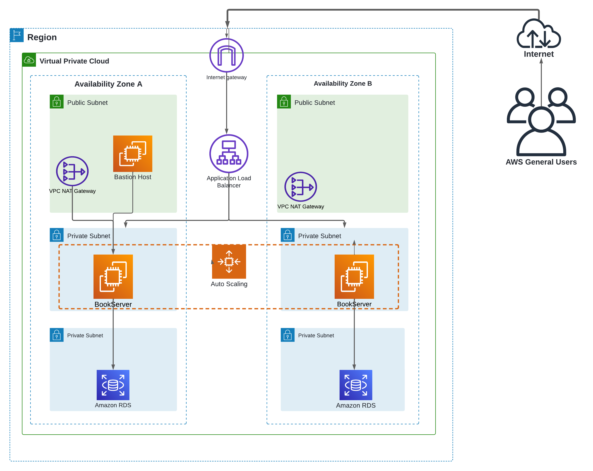

# Bootcamp Talento Tech Arquitectura de Nube
Despliegue de una arquitectura de AWS altamente disponible y escalable en AWS

## Planificación


### Requerimientos

* Requerimiento 1
* Requerimiento 2
* Requerimiento 3

### Arquitectura

En la siguiente imagen se muestra el diseño de la arquitectura a partir de los requerimientos


## Ejecución
### En primera instancia debemos conectarnos con AWS mediante el siguiente comando:
  ```
aws configure
```
### Nos pedirá el Key ID y el Secret Access Key que debemos tener previamente configuradas para este ejercicio, como se ve en la siguiente imagen


### En segunda instancia debemos crear un repositorio en CodeCommit; el cual es un servicio de control de código fuente de administrado y altamente escalable que aloja repositorios Git privados. Este repositorio nos servira como plataforma de despliegue de nuestra arquitectura. Esto lo podemos realizar mediante el siguiente comando:
```
aws codecommit create-repository --repository-name infraestructura-aws --repository-description "crear infraestructura en aws"
```
### De ser exitoso el output del comando lucirá así:


### A continuación debemos asegurar que la sintaxis del  los archivos yml este escritos correctamente según los estructura de AWS, ya que en estos archivos se encuentra toda la infraestructura de nuestra arquitectura. Los validamos con el siguientes códigos:

```
aws cloudformation validate-template --template-body file://network.yml
```
```
aws cloudformation validate-template --template-body file://application.yml
```


### Pequeña descripcion sobre la fase de ejecución. Se utilizó el servicio de CloudFormation que es un servicio de infraestructura como código para realizar el despliegue de la arquitectura. Utilizamos el siguiente comando para realiza el despliegue de la arquitectura:
Primero debemos realizar la validación


