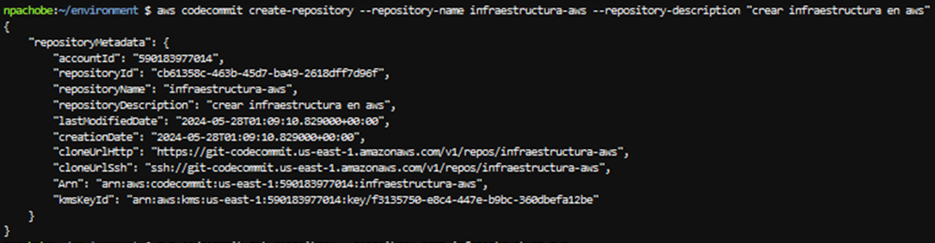

# Bootcamp Talento Tech Arquitectura de Nube
Despliegue de una arquitectura de AWS altamente disponible y escalable en AWS

## Planificación


### Requerimientos

* Requerimiento 1
* Requerimiento 2
* Requerimiento 3

### Arquitectura

En el siguiente link esta nuestra arquitectura

[AWS_Well_Architect_Framework](docs/AWS_Well_Architect_Framework.md)

## Ejecución
En primera instancia debemos conectarnos con AWS mediante el siguiente comando:
  ```
aws configure
```
Nos pedirá el Key ID y el Secret Access Key que debemos tener previamente configuradas para este ejercicio, como se ve en la siguiente imagen


En segunda instancia debemos crear un repositorio en CodeCommit; el cual es un servicio de control de código fuente de administrado y altamente escalable que aloja repositorios Git privados. Este repositorio nos servira como plataforma de despliegue de nuestra arquitectura. 

Esto lo podemos realizar mediante el siguiente comando:
```
aws codecommit create-repository --repository-name infraestructura-aws --repository-description "crear infraestructura en aws"
```
De ser exitoso el output del comando lucirá así:



A continuación debemos asegurar que la sintaxis del  los archivos yml de este repositorio estén escritos correctamente según los estructura de AWS, ya que en estos archivos se encuentra toda la infraestructura de nuestra arquitectura. Los validamos con el siguientes códigos:

```
aws cloudformation validate-template --template-body file://network.yml
```
```
aws cloudformation validate-template --template-body file://application.yml
```

Luego debemos enviarlos a repositorio de CodeCommit con el siguiente comando:

```
git push https://git-codecommit.us-east-1.amazonaws.com/v1/repos/infraestructura-aws
```
En la consola de AWS se verá asi:


Después debemos configurar el servicio de Parameter Store de Systems Manager (SSM) de AWS, el cual proporciona un almacenamiento seguro y jerárquico para administrar los datos de configuración, los cuales necesitaremos configurar para nuestro servicio. Los parametros a configurar son los siguientes

   
   


Por otro lado, debemos configurar un Rol en  Identity and Access Management (IAM), el cual es un servicio web que nos  ayuda a controlar de forma segura el acceso a los recursos de AWS. Ya que necesitamos darle permisos  a las instancias que soportaran nuestra pagina web para que puedan acceder al System Manager (SSM) donde se encuentran los parámetros de configuración de la página web  y a S3,que es donde estarán alojado los archivos de pagina web y la base de datos. 

Una vez configurado el rol se verá así


Además, para poder conectarnos a las instancias en las redes privadas de nuestra arquitectura debemos tener configurada una llave de acceso en .ppk para acceso a Putty y está deberá ir escrita en nuestro yml en los atributos que requieran el keyname (keypairtest) de la instancia, asi como el Rol de IAM para la conexiones a S3 y SSM(RoleBook).


### Configuración de Pipelines
#### Network Pipeline

Aqui vamos a crear un stack de recursos el cual configurar las redes públicas, redes privadas, IPs elasticas, route tables, zonas de disponibilidad desde las cuales se desplegará el servicio

Para hacerlo debemos entrar a Codepipeline, el cual es un servicio de entrega continua completamente administrado que permite automatizar las canalizaciones de lanzamiento para lograr actualizaciones de infraestructura y aplicaciones rápidas y fiables.
Luego, presionamos Create Pipeline y seguimos los etapas

#### Etapa 1: Configuración del Pipeline
 * Nombre del Pipeline : network-pipeline
 * Tipo de Pipeline: V2
 * Modo de ejecución: Superseed
 * Rol de Servicio: Se puede crear uno o seleccionar uno ya existente. Este es para dar permisos a CodePipeline para implementar la capa de red, por ejemplo a interactuar con CodeCommit

Esta configuración lucirá asi:


#### Etapa 2: Origen/Fuente
 * Proveedor de los códigos fuente: AWS CodeCommit
 * Nombre del repositorio: infraestructura-aws
 * Nombre de la rama: master
 * Opciones de detección de cambios: AWS CodePipeline
 * Fomato de Salida del Artefacto: CodePipeline Default

Esta configuración lucirá asi:


 #### Etapa 3: Construcción
  Nos saltamos esta etapa


 #### Etapa 4: Despligue

Para este rol debemos antes ir a IAM y crear un Rol para CloudFormation que tenga tenga los acceso total a EC2, RDS,SSM, VPC e IAM para que pueda construir la infraestructura. Este se llamará RolePipeline

Este rol se vera así:


Luego configuramos el resto de parámetros:
 * Proveedor de Despliegue: AWS CloudFormation
 * Region: US East (N. Virginia)
 * Modo de Acción : Crear o actualizar stack
 * Nombre del stack: network-stack
 * Template:
   * Nombre del artefacto: Artefacto Fuente
   * Nombre del Archivo: network.yml
 * Nombre del Rol: RolPipeline
   Así que da la configuración
	


#### Etapa 5 : Revisión 

Aqui se revisa los  detallado en las etapas previas. Al final le damos crear

A continuación se comienza a desplegar la capa de network, esto se verá en la consola de AWS CodePipeline similar a esto:


Y si vamos a CloudFormation al finalizar el despligue lucirá algo como esto:


Este  despliegue es rápido, no debe tardar mas de 2 o 3 minutos a diferencia del siguiente pipeline

### Pipeline Application


	


### Despligue


	

	


	


	


### Pequeña descripcion sobre la fase de ejecución. Se utilizó el servicio de CloudFormation que es un servicio de infraestructura como código para realizar el despliegue de la arquitectura. Utilizamos el siguiente comando para realiza el despliegue de la arquitectura:
Primero debemos realizar la validación


