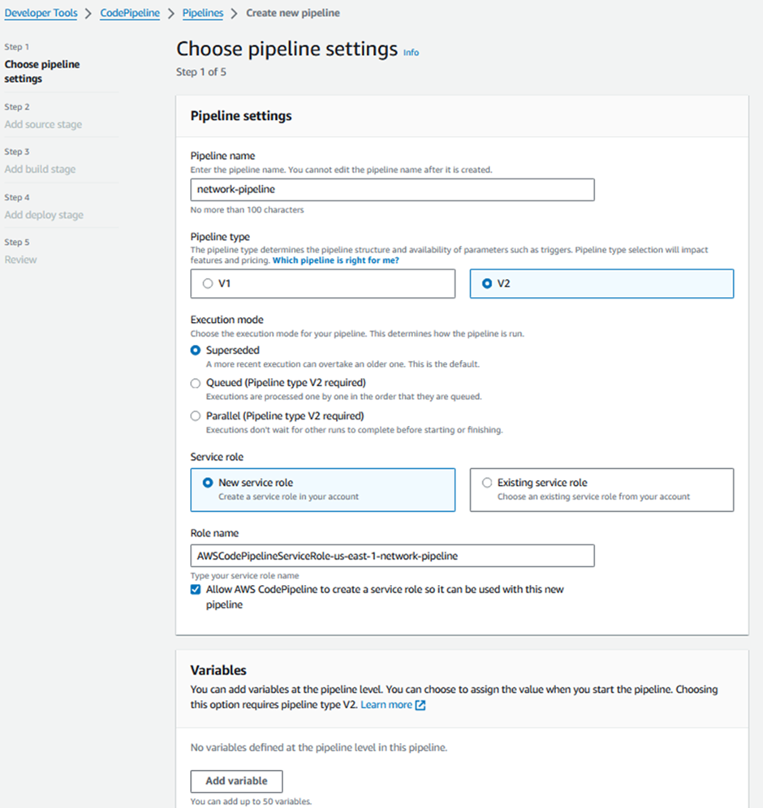

# Bootcamp Talento Tech Arquitectura de Nube
Despliegue de una arquitectura de AWS altamente disponible y escalable en AWS

## Planificación


### Requerimientos

* Requerimiento 1
* Requerimiento 2
* Requerimiento 3

### Arquitectura

En el siguiente link esta nuestra arquitectura

[AWS_Well_Architect_Framework](docs/AWS_Well_Architect_Framework.md)

## Ejecución
En primera instancia debemos conectarnos con AWS mediante el siguiente comando:
  ```
aws configure
```
Nos pedirá el Key ID y el Secret Access Key que debemos tener previamente configuradas para este ejercicio, como se ve en la siguiente imagen


En segunda instancia debemos crear un repositorio en CodeCommit; el cual es un servicio de control de código fuente de administrado y altamente escalable que aloja repositorios Git privados. Este repositorio nos servira como plataforma de despliegue de nuestra arquitectura. 

Esto lo podemos realizar mediante el siguiente comando:
```
aws codecommit create-repository --repository-name infraestructura-aws --repository-description "crear infraestructura en aws"
```
De ser exitoso el output del comando lucirá así:


A continuación debemos asegurar que la sintaxis del  los archivos yml de este repositorio estén escritos correctamente según los estructura de AWS, ya que en estos archivos se encuentra toda la infraestructura de nuestra arquitectura. Los validamos con el siguientes códigos:

```
aws cloudformation validate-template --template-body file://network.yml
```
```
aws cloudformation validate-template --template-body file://application.yml
```

Luego debemos enviarlos a repositorio de CodeCommit con el siguiente comando:

```
git push https://git-codecommit.us-east-1.amazonaws.com/v1/repos/infraestructura-aws
```
En la consola de AWS se verá asi:


Después debemos configurar el servicio de Parameter Store de Systems Manager de AWS, el cual proporciona un almacenamiento seguro y jerárquico para administrar los datos de configuración, los cuales necesitaremos configurar para nuestro servicio. Los parametros a configurar son los siguientes

   
   


Por otro lado, debemos configurar un Rol en  Identity and Access Management (IAM), el cual es un servicio web que nos  ayuda a controlar de forma segura el acceso a los recursos de AWS. Ya que necesitamos darle permisos  a las instancias que soportaran nuestra pagina web para que puedan acceder al System Manager SS donde se encuentran los parámetros de configuración de la página web  y a S3,que es donde estarán alojado los archivos de pagina web y la base de datos. 

Una vez configurado el rol se verá así


Además, para poder conectarnos a las instancias en las redes privadas de nuestra arquitectura debemos tener configurada una llave de acceso en .ppk para acceso a Putty y está deberá ir escrita en nuestro yml en los atributos que requieran el keyname (keypairtest) de la instancia, asi como el Rol de IAM para la conexiones a S3 y SSM(RoleBook).



	


	


	


### Pequeña descripcion sobre la fase de ejecución. Se utilizó el servicio de CloudFormation que es un servicio de infraestructura como código para realizar el despliegue de la arquitectura. Utilizamos el siguiente comando para realiza el despliegue de la arquitectura:
Primero debemos realizar la validación


