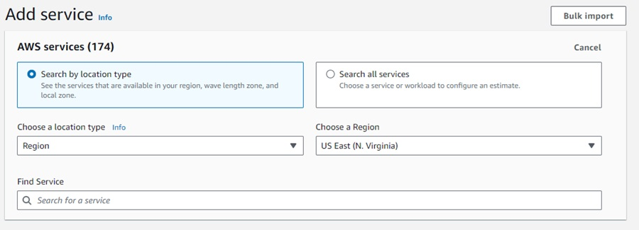
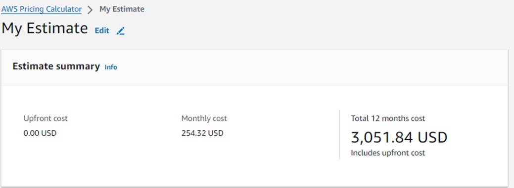
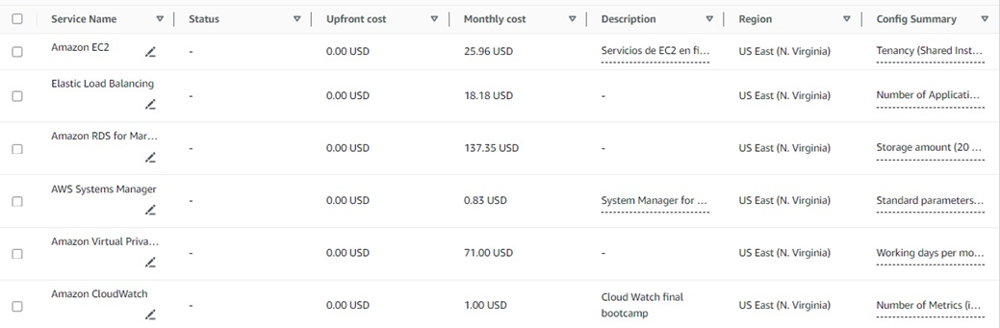

# Presupuesto
### AWS Pricing Calculator.

AWS Pricing Calculator es un servicio web que puede utilizar para crear estimaciones de costes que coincidan con los casos de uso de AWS. 
Para nuestro caso nos ayuda a tener una estimación de cuanto los valores de los requerimientos para tener en funcionamiento los diferentes servicios para desplegar el servidor Web, que es un ecommerce para una Librería y calcularemos cuanto nos cuesta al mes y al año.
Los servicios se estimarán dentro de la región de North Virginia:

# Estimación de Costos AWS para Servidor Web

## 1. Servicios de EC2 (Máquinas virtuales EC2)

Se hará la estimación de un lanzamiento de una promoción una vez al mes, con un pico de tráfico en el mes y se tendrán como Baseline 3 instancias, 2 en las subredes privadas y 1 el bastion host, cuando ocurre el pico en total tendremos 5 instancias.

En la política de escalamiento determinamos que si la CPU está por encima del umbral queremos que se provisionen 2 instancias más, 1 por cada zona de disponibilidad, durante 1 día.

- **Tipo de instancia:** t2.micro
- **Plan de Pago:** On-Demand
- **Costo mensual:** 25.96 USD
- **Resumen de utilización:**
  - Horas de instancia On-Demand: 2238
  - Costo total de instancias On-Demand: 25.96 USD
- No se incluyen servicios adicionales como Amazon Elastic Block Store (EBS), monitoreo detallado o transferencia de datos.

## 2. Servicio de Elastic Load Balancing (Application Load Balancer)
Seleccionamos con el que hemos venido trabajando que es: Application Load Balancer en la región de N. Virginia.

Solamente tenemos 1, que es el que recibe las peticiones de los usuarios desde internet.
Se hace un calculo preliminar de acuerdo a las unidades de capacidad del balanceador de carga, para ellos se hace una estimación, de acuerdo a los target del servicio, en este caso en función Lambda 0.

- **Balanceador de carga:** Application Load Balancer (N. Virginia)
- **Costo fijo por hora:** 16.43 USD
- **Cálculo preliminar:**
  - Peticiones procesadas por hora: 0.3 GB (bytes)
  - Reglas de procesamiento: 1
  - Cálculo de LCUs (Unidades de Capacidad de Carga):
    - 0.30 procesamiento de bytes LCUs
    - 0.30 máximo de LCUs
  - Costo total de LCUs: 1.75 USD

## 3. Base de datos con Amazon RDS for MariaDB

Se configura con la misma región en la que hemos colocado todos los servicios N. Virginia y con solo una instancia, aunque en la arquitectura se muestran dos, mostrando que se podría habilitar la opción de alta disponibilidad. 

- **Instancia seleccionada:** db.m3.large (vCPU: 2, Memoria: 7.5 GiB)
- **Costo por hora:** 0.185 USD
- **Costo mensual (100% de utilización):** 135.05 USD
- **Costo de almacenamiento (SSD de propósito general):** 2.30 USD (20 GB)
- Sin servicios adicionales (no se utiliza RDS Proxy)

## 4. AWS Systems Manager

En el parameter store se tienen 5 condiciones que garantizan la continuidad oportuna de los servicios. Se coloca el valor con unas interacciones estimadas de 100 por hora, en total 4 Estándar y 2 avanzadas.

- **Parameter Store:**
  - 5 condiciones con 100 interacciones estimadas por hora.
  - Costo de almacenamiento avanzado: 0.10 USD
  - Costo de interacciones API: 0.73 USD
  - Costo total: 0.83 USD

## 5. Amazon Virtual Private Cloud (VPC)

El numero de direcciones privadas será de 1 con disponibilidad de 24 horas al dia y publicas IPv4 integradas a las instancias EC2 y a los servicios de AWS son 2, y el número de Zonas de disponibilidad del Gateway Load Balancer es 2.

- **Direcciones IP:**
  - 1 dirección privada (24/7): Sin costo adicional
  - 2 direcciones IPv4 públicas integradas a instancias EC2 y servicios de AWS: 7.30 USD
- **Gateway Load Balancer:**
  - 2 zonas de disponibilidad: 18.25 USD
  - 1 endpoint de balanceador de carga: 7.30 USD
  - Transferencia de datos procesados: 0.77 USD
  - Costo total: 8.07 USD

## 6. Amazon CloudWatch

Las métricas que se incluirán en la estimación de los servicios para cloud watch son 3.

- **Métricas:**
  - 3 métricas: 0.90 USD
- **API de CloudWatch:**
  - 3 métricas solicitadas: 0.00003 USD
- **Dashboard y Alarmas:**
  - 1 métrica de alarma estándar: 0.10 USD

**Nota:** Los servicios excluidos del cálculo son Canaries, Contributor Insights para CloudWatch Logs, Contributor Insights para DynamoDB, Lambda Insights, RUM Event, Internet Monitor y Application Signals.

