# Seguimiento y control

A continuación, se explicará como configurar una alarma mediante CLoudWatch de AWS para vigilar el uso de CPU del la arquitectura desplegada.

## Paso 1: Agregar política CloudWatchAgentServerPolicy al Rol de EC2

En primera lugar, debemos añadirle un permisos más al rol IAM de las instancias EC2; este es el CloudWatchAgentServerPolicy, el cual permirá vigilar el consumo de CPU de las instancias por parte de CloudWatch

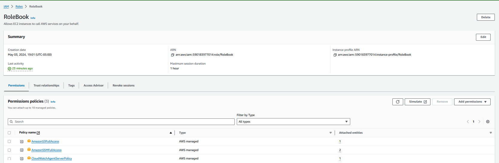

## Paso 2: Instalar  AmazonCloudWatchAgent

En segundo lugar, nos dirigimos System Manager (SSM), a Fleet Manager, este servcio nos permite correr comandos en varias instancias EC2 al mismo tiempo; seleccionamos el bastión host (book-ws-public) y las otras 2 instancias generafas por la aruitectura elástica desplegada. 

Después vamos a Node Actions y a Execute run command

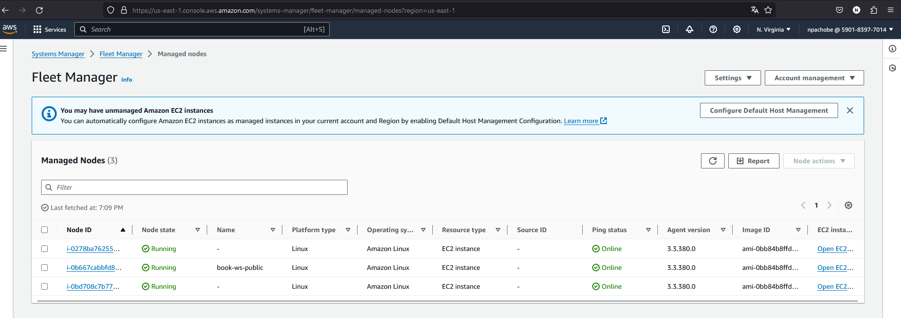

Aquí escribimos en el buscador ConfigureAwsPackage y seleccionamos  AWS-ConfigureAWSPackage, luego llenamos los parámetros de la siguiente manera:
* Document version: 1 Default
* Action: Install
* Installation Type: Uninstall and reinstall
* Name: AmazonCloudWatchAgent
* Version: latest
no tocamos el resto de parámetros y le damos run.

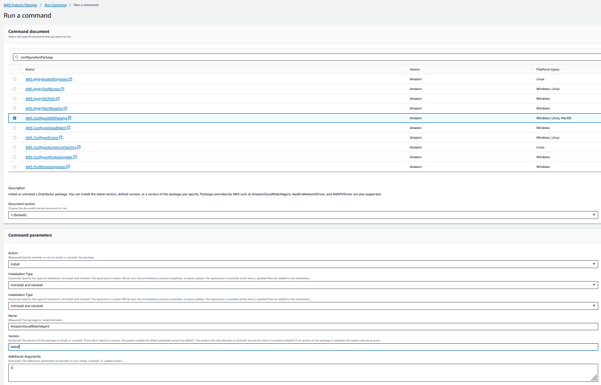

Aqui vemos ejecutandose la instalación.

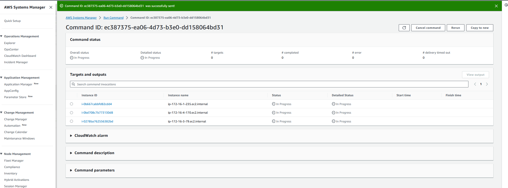

## Paso 3: Añadir parámetro de monitoreo

Para poder continuar debemos dirigirnos Parameter Store de System Manager (SSM) y crear un nuevo parametro llamado monitoreoEC2

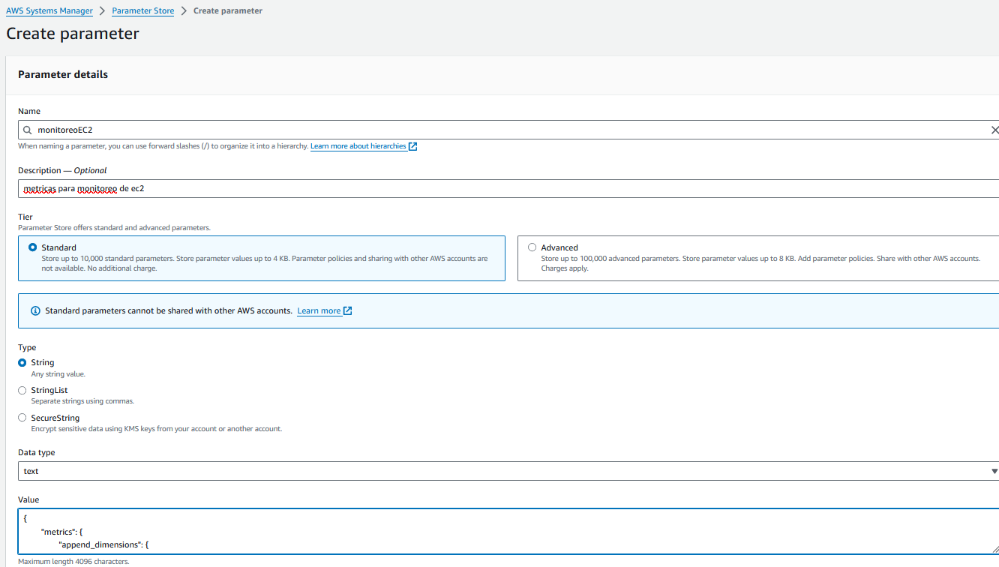

y en valor colocamos el siguiente texto

```
{
        "metrics": {
                "append_dimensions": {
                        "AutoScalingGroupName": "${aws:AutoScalingGroupName}",
                        "ImageId": "${aws:ImageId}",
                        "InstanceId": "${aws:InstanceId}",
                        "InstanceType": "${aws:InstanceType}"
                },
                "metrics_collected": {
                        "cpu": {
                                "measurement": [
                                        "cpu_usage_idle",
                                        "cpu_usage_iowait",
                                        "cpu_usage_user",
                                        "cpu_usage_system"
                                ],
                                "metrics_collection_interval": 60,
                                "totalcpu": false
                        },
                        "disk": {
                                "measurement": [
                                        "used_percent",
                                        "inodes_free"
                                ],
                                "metrics_collection_interval": 60,
                                "resources": [
                                        "*"
                                ]
                        },
                        "diskio": {
                                "measurement": [
                                        "io_time"
                                ],
                                "metrics_collection_interval": 60,
                                "resources": [
                                        "*"
                                ]
                        },
                        "mem": {
                                "measurement": [
                                        "mem_used_percent"
                                ],
                                "metrics_collection_interval": 60
                        },
                        "swap": {
                                "measurement": [
                                        "swap_used_percent"
                                ],
                                "metrics_collection_interval": 60
                        }
                }
        }
}
```
Teniendo ahora 5 parámetros

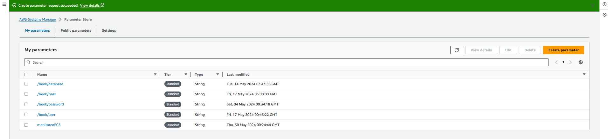

## Paso 4: Configurar CloudWatch-ManageAgent

Nos dirigimos a Fleet Manager, seleccionamos las instancias involucradas en el arquitectura


Aquí escribimos en el buscador CloudWatch y seleccionamos AmazonCloudWatch-ManageAgent


En los parámetros escribimos lo siguiente:

* Action: configure
* Mode: ec2
* Optional Configuration Source : ssm
* Optional Configuration Location : monitoreoEC2
* Optional Restart : yes
* Target Selection : choose instances manually
* Timeout(seconds):600
  
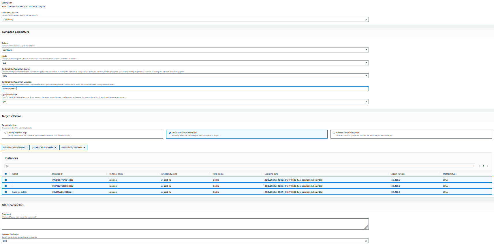

y le damos run 

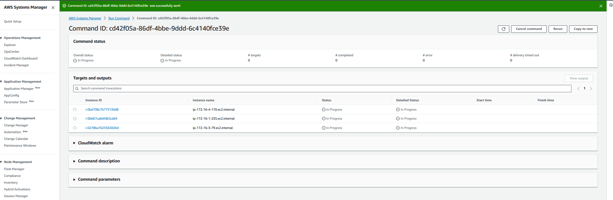

Luego validamos que se hallan ejecutado las ordenes

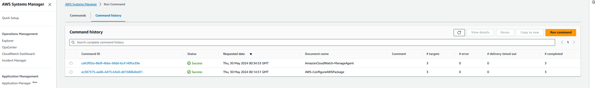

Para asegurarnos que los pasos anteriores pasos hallan funcionado nos vamos a CloudWatch, luego All metrtics y en el buscador pegamos el Id de alguna instancias EC2 en la cual hallamos ejecutado las órdenes y veremos la siguiente pantalla.

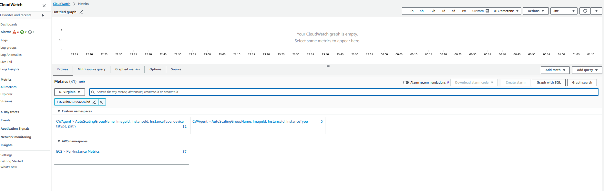

y podemos encontrar la metrica CPUUtilization

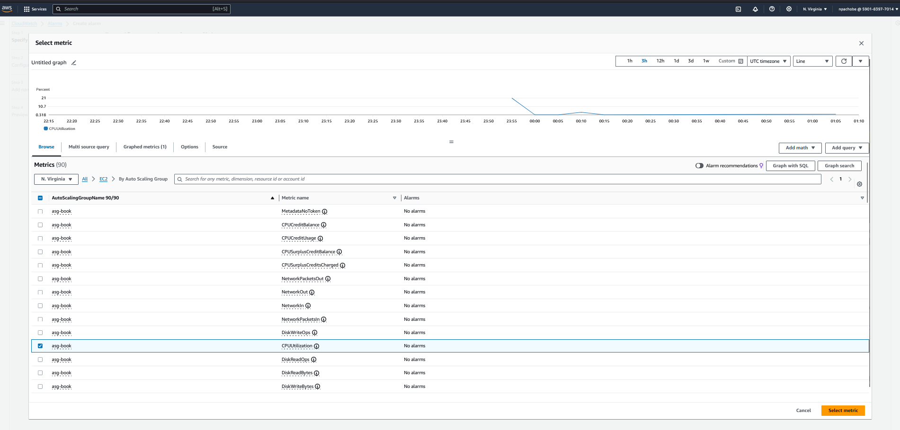

## Paso 5: Crear Alarma

Nos vamos a CloudWatch Alarms y le damos Create alarm

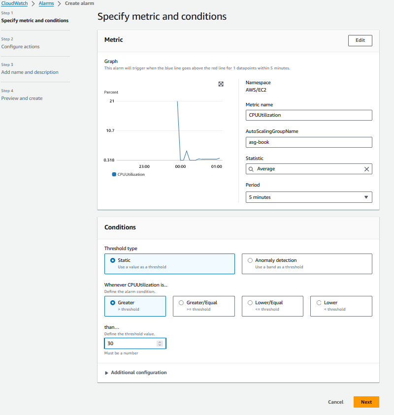


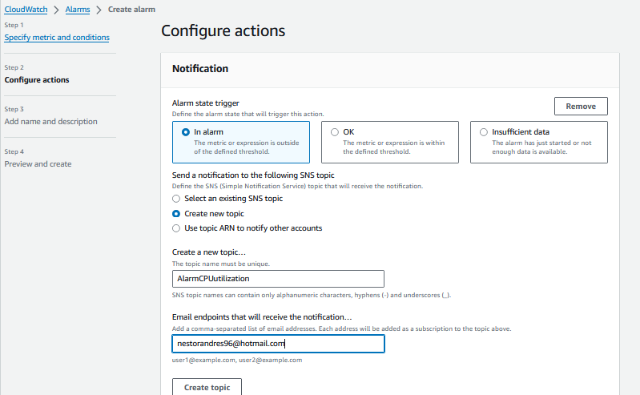
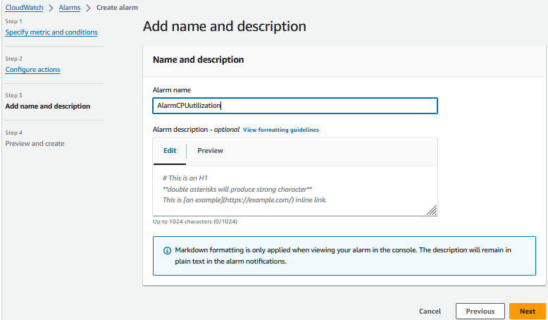
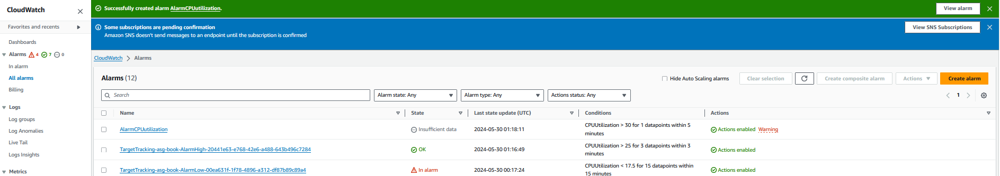
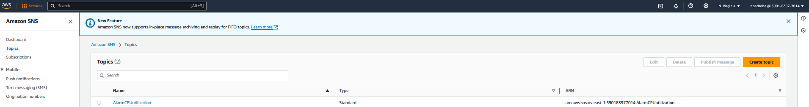
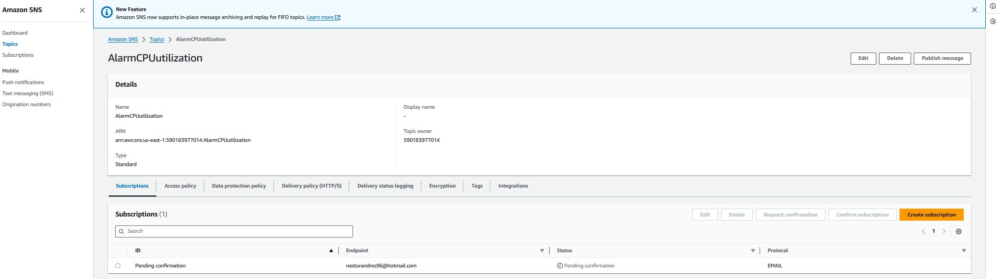
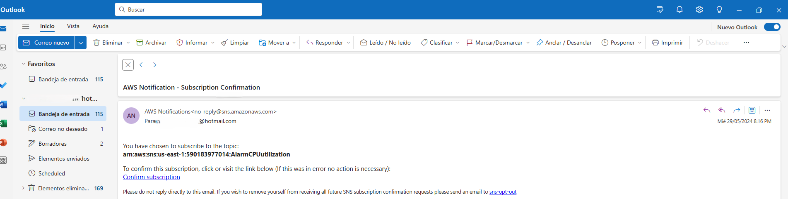
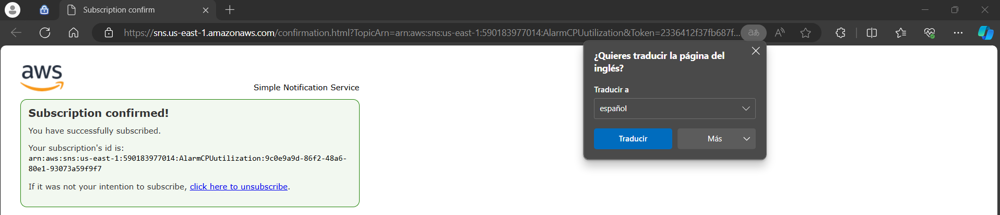
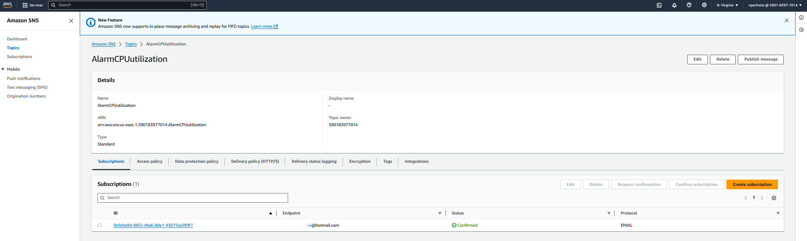
