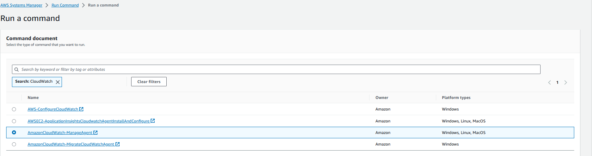

# Seguimiento y control





```
{
        "metrics": {
                "append_dimensions": {
                        "AutoScalingGroupName": "${aws:AutoScalingGroupName}",
                        "ImageId": "${aws:ImageId}",
                        "InstanceId": "${aws:InstanceId}",
                        "InstanceType": "${aws:InstanceType}"
                },
                "metrics_collected": {
                        "cpu": {
                                "measurement": [
                                        "cpu_usage_idle",
                                        "cpu_usage_iowait",
                                        "cpu_usage_user",
                                        "cpu_usage_system"
                                ],
                                "metrics_collection_interval": 60,
                                "totalcpu": false
                        },
                        "disk": {
                                "measurement": [
                                        "used_percent",
                                        "inodes_free"
                                ],
                                "metrics_collection_interval": 60,
                                "resources": [
                                        "*"
                                ]
                        },
                        "diskio": {
                                "measurement": [
                                        "io_time"
                                ],
                                "metrics_collection_interval": 60,
                                "resources": [
                                        "*"
                                ]
                        },
                        "mem": {
                                "measurement": [
                                        "mem_used_percent"
                                ],
                                "metrics_collection_interval": 60
                        },
                        "swap": {
                                "measurement": [
                                        "swap_used_percent"
                                ],
                                "metrics_collection_interval": 60
                        }
                }
        }
}
```
